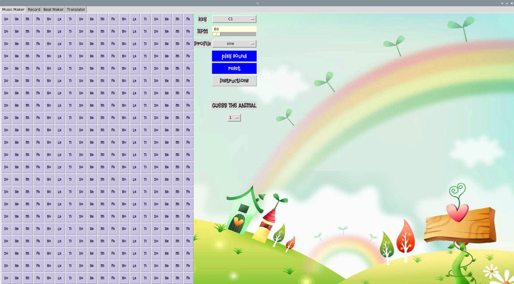
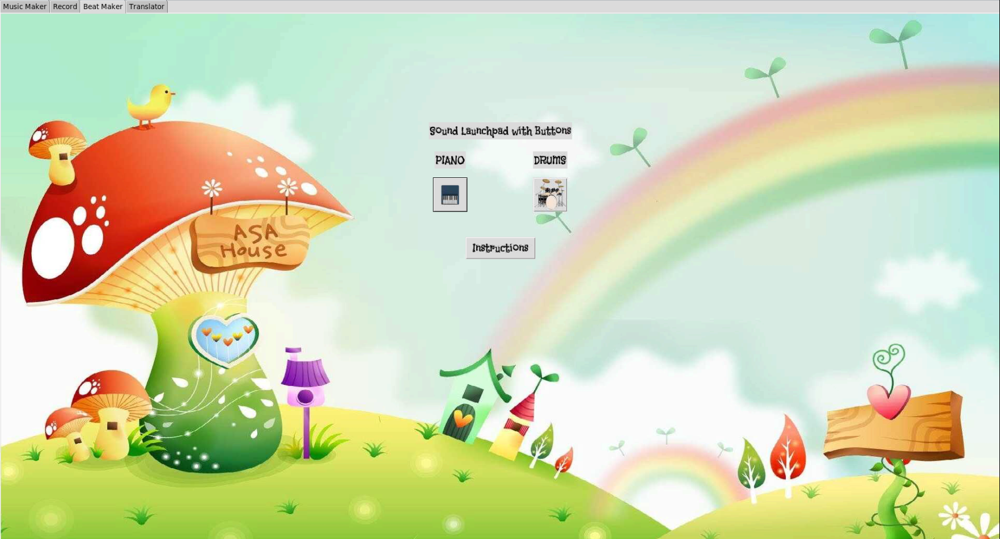
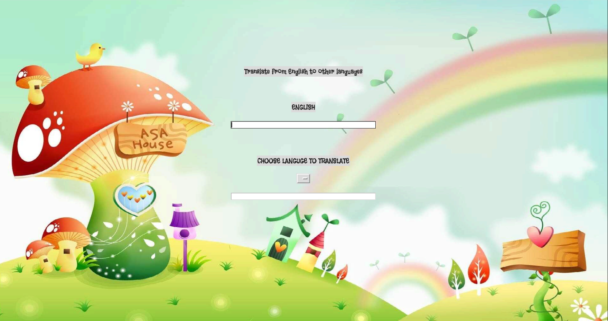
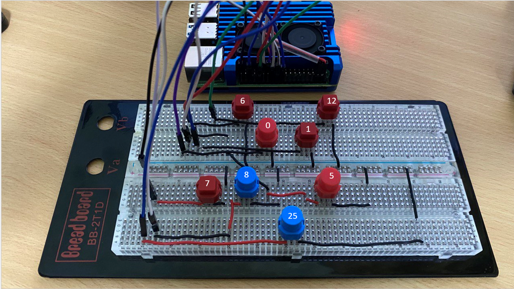
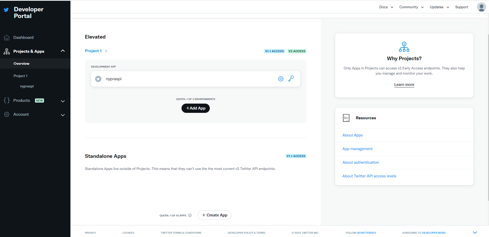
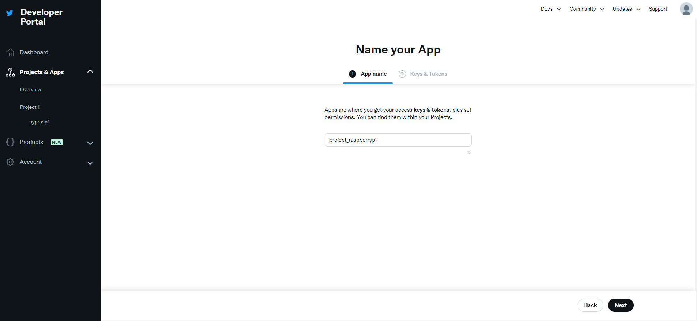
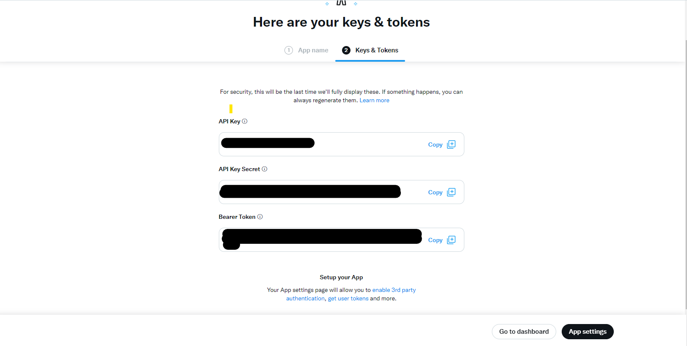
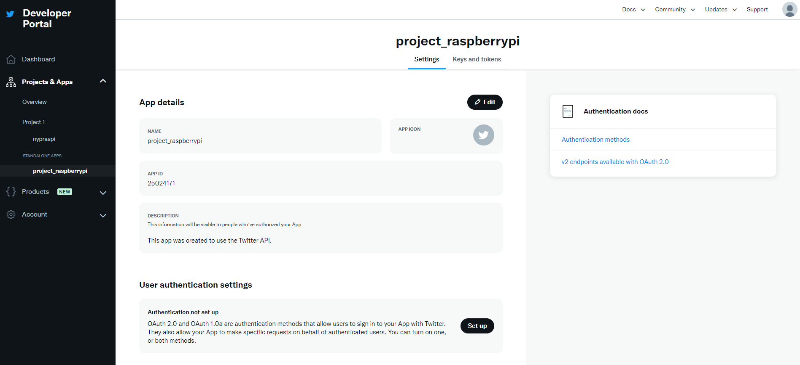
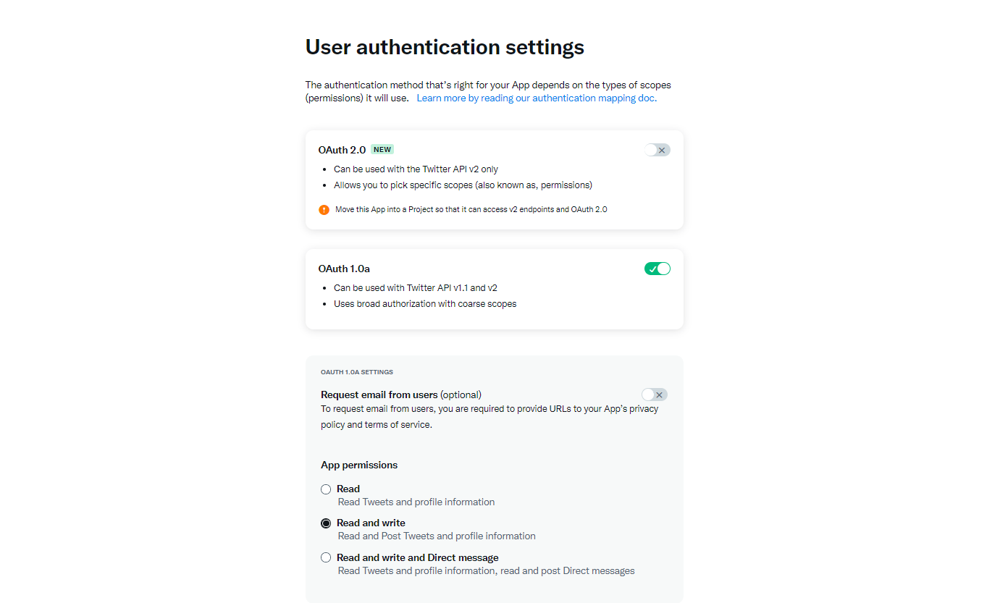
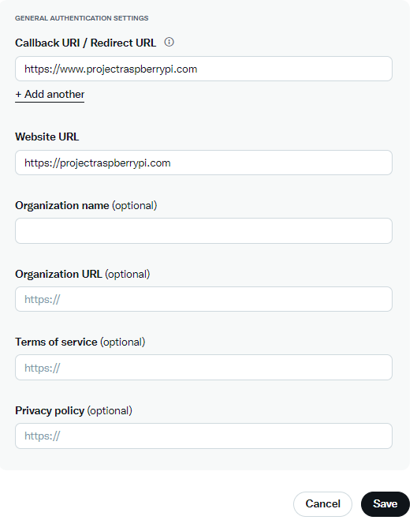

# RasPiratory System
Raspberry Pi Project on “Learning & Creating Art with Sound”. This project is to encourage children from the age of 5 - 12 years to expand their knowledge about the different types of sounds.

## Features
**Music Maker:** It piques their interest in music and encourages them to be more creative by creating their own scale while teaching them about different kinds of sounds other than the usual musical instruments they see or hear.

**Record:** The **Record** function allows users to make a 4-second recording, which will be converted into a picture of an audio waveform and spectrogram. The converted image will then be uploaded automatically to a Twitter account, where it is displayed with other converted images.

**Beat Maker:** Users can choose either the Drums or Piano mode in the **Beat Maker** function. In the Drums mode, clicking the push buttons will produce different sounds based on an drum set. Likewise for the Piano mode, clicking on the buttons will produce different sounds based on a piano. 

**Translator:** The **Translator** function allows users to translate any text in English to other languages. This function also enables users to hear the translated text. The supported languages include Chinese, Malay, Korean, Japanese, Tamil, French, Spanish, and Vietnamese. 

## Components
| No. | Component |
| ----------- | ----------- |
|1|Raspberry Pi 4 (Recommended)|
|2|Keyboard & Mouse|
|3|USB Audio Adapter (USB - 3.5mm Mic Input)|
|4|Mic (3.5mm)|
|5|Breadboard|
|6|8 Push Buttons|
|7|Some Jumper Cables / Dupont Cable (Male-Male) & (Male-Female)|
|8|Speakers / Earphones|

## Setup
### Setting up the hardware
***Connecting the USB Audio Adapter, Mic, and Speakers to the Raspberry Pi***
1. Connect the Mic to the mic input of the USB Audio Adapter.
2. Connect the USB Audio Adapter to the USB-A port of the Raspberry pi.
3. Connect the Speakers/Earphones to the 3.5mm jack of the Raspberry Pi.   

***Connecting the Buttons, Breadboard and Dupont Cables to the Raspberry Pi***
1. Connect all 8 Push Buttons to the Breadboard.
2. One end of the Push Button must be connected to Ground, and the other end connected to a GPIO pin on the Raspberry Pi.
    - GPIO pins used are GPIO pin 0, 1, 5, 6, 7, 8, 12, 25.

### Setting up the code
To start off, we will need to install a list of modules/libraries on our Raspberry Pi. We will install all these modules using the terminal.
First, lets type in `sudo apt update` followed by `sudo apt upgrade`.
1. **sox library**
    - `sudo apt install sox`

2. **pygame**
    - `pip3 install pygame`

3. **PIL a.k.a pillow**
    - `pip3 install Pillow`

4. **gtts**
    - `pip3 install gTTS`

5. **SpeechRecognition**
    - `pip3 install SpeechRecognition`

6. **translate**
    - `pip3 install translate`

7. **PyAudio**
    - `pip3 install PyAudio`

8. **wave**
    - `pip3 install Wave`

9. **gpiozero**
    - `pip3 install gpiozero`

10. **twython**
    - `pip3 install twython`

11. **pydub**
    - `pip3 install pydub`

12. **matlpotlib**
    - `pip3 install matplotlib`

13. **scipy**
    - `pip3 install scipy`

14. **numpy**
    - `pip3 install numpy`
    
After installing the relevant modules, you can clone the repositiory into your Raspberry Pi.
`git clone https://github.com/MuhammadZihni/sorpiart-teamEfyp`

## How does the code work?
`project.py` is the main script for this program and it contains the Graphical User Interface (GUI) of the program

## Using Twitter Bot to upload images and captions automatically
***Follow these steps if you want to use the Twitter Bot.***  
>***If not using the Twitter Bot, remove lines 102-126 from `displayingSpectrogram.py` and skip this portion.***  
In order for the Twitter Bot to work, here are a few things that you need:  
&nbsp;&nbsp;    - twython module  
&nbsp;&nbsp;    - Twitter developer account  
&nbsp;&nbsp;    - Twitter application

**Apply for a Twitter developer account**
1. Create a Twitter account (if you don't already have one) at [twitter.com](https://twitter.com).
2. Apply for a Twitter developer account at [developer.twitter.com (Twitter Developer Portal)](https://developer.twitter.com).
3. To complete the developer application, follow the steps at [projects.raspberrypi.org/twitter](https://projects.raspberrypi.org/en/projects/getting-started-with-the-twitter-api/2).

**Create a Twitter application**
1. Go to [developer.twitter.com](https://developer.twitter.com), select **Project & Apps** from the menu, click on **Overview** and select **+Create App**.
   
2. Create an **App name** and click **Next**.
   
3. Jot down the **Keys & Tokens** which will be needed for authentication later, and click **App settings**.
    
4. Under **User authentication settings**, click on **Set up**.
   
5. Turn on **OAuth 1.0a** and set **App permissions** to **Read and write**. Give a random **Callback URL / Redirect URL** and **Website URL**, and click **Save**.  

6. Modify the `auth_twitter.py` file with your **Keys & Tokens** from step 3. 
> If you forgot to save the **Keys & Tokens** earlier, you can regenerate it again at the Twitter Developer Portal.

## To run Tkinter GUI on boot
In order to run your tkinter gui script (**e.g. main.py**) everytime the **Raspberry Pi** boots up, we can utilise on **autostart**. 

### Configuration (autostart)
1. open terminal
2. change directory to **.config** `cd .config/`
3. Create an **autostart** folder
3.1 `mkdir autostart`
4. copy **tkinterautostart.desktop** into the folder
4.1 `cp ~/sorpiart/tkinterautostart.desktop ~/.config/autostart/`
5. edit **tkinterautostart.desktop** 
5.1 `nano ~/.config/autostart/tkinterautostart.desktop`