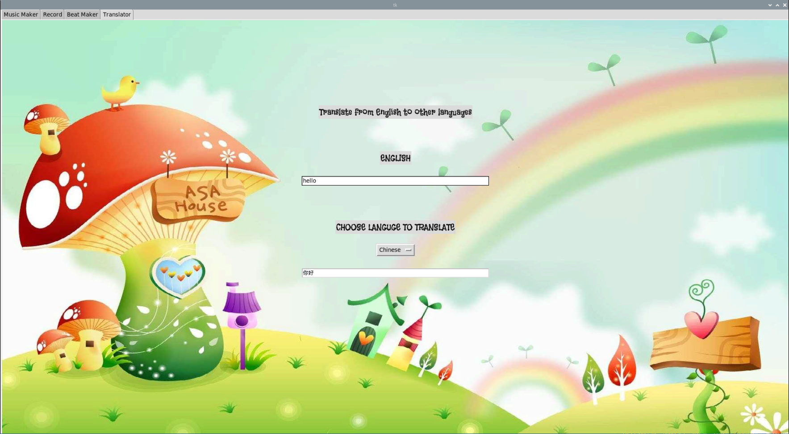

# sorpiart
Raspberry Pi Project on “Learning & Creating Art with Sound”. This project is to encourage children from the age of 5 - 12 years to expand their knowledge about the different types of sounds. We hope it will help to stimulate their brain growth by exposing them to different types of sounds.

## Features
**Music Maker:**

**Record:** The **Record** function allows users to make a 4-second recording, which will be converted into a picture of an audio waveform and spectrogram. The converted image will then be uploaded automatically to a Twitter account, where it is displayed with other converted images.

**Beat Maker**

**Translator:** The **Translator** function allow users to translate any text in English to other languages. This function also allows users to hear the translated text. The supported languages include Chinese, Malay, Korean, Japanese, Tamil, French, Spanish, and Vietnamese. 

## To run Tkinter GUI on boot
In order to run your tkinter gui script (**e.g. main.py**) everytime the **Raspberry Pi** boots up, we can utilise on **autostart**. 

### Configuration (autostart)
1. open terminal
2. change directory to **.config** `cd .config/`
3. Create an **autostart** folder
3.1 `mkdir autostart`
4. copy **tkinterautostart.desktop** into the folder
4.1 `cp ~/sorpiart/tkinterautostart.desktop ~/.config/autostart/`
5. edit **tkinterautostart.desktop** 
5.1 `nano ~/.config/autostart/tkinterautostart.desktop`

## Setup
To start off, we will need to install a list of modules/libraries on our Raspberry Pi. We will install all these modules using the terminal.
1. **sox library**
    - `sudo apt install sox`

2. **pygame**
    - `pip3 install pygame`

3. **PIL a.k.a pillow**
    - `pip3 install Pillow`

4. **gtts**
    - `pip3 install gTTS`

5. **SpeechRecognition**
    - `pip3 install SpeechRecognition`

6. **translate**
    - `pip3 install translate`

7. **PyAudio**
    - `pip3 install PyAudio`

8. **wave**
    - `pip3 install Wave`

9. **gpiozero**
    - `pip3 install gpiozero`

10. **twython**
    - `pip3 install twython`

11. **pydub**
    - `pip3 install pydub`

12. **matlpotlib**
    - `pip3 install matplotlib`

13. **scipy**
    - `pip3 install scipy`

14. **numpy**
    - `pip3 install numpy`
    
After installing the rlevant modules, you can clone the repositiory into your Raspberry Pi.
`git clone https://github.com/MuhammadZihni/sorpiart-teamEfyp`

## Using Twitter Bot to upload images and captions automatically
In order for the Twitter Bot to work, here are a few things that you need:
    - twython module
    - Twitter developer account
    - Twitter application

**Apply for a Twitter developer account**
1. Create a Twitter account (if you don't already have one) at [twitter.com](https://twitter.com).
2. Apply for a Twitter developer account at [developer.twitter.com](https://developer.twitter.com).
3. To complete the developer application, follow the steps at [projects.raspberrypi.org/twitter](https://projects.raspberrypi.org/en/projects/getting-started-with-the-twitter-api/2).

**Create a Twitter application**
1. Go to [developer.twitter.com](https://developer.twitter.com), select **Developer Portal** from the menu, click on **Project & Apps** and select **Overview**.

