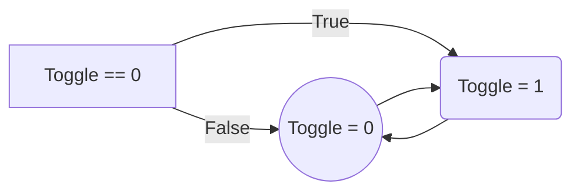

# Team C project code

```
from tkinter import *
import tkinter as tk
from tkinter import ttk
from pix2music import *
from tkinter import messagebox
from PIL import Image, ImageTk
from tkinter import font
import time
#time.sleep(6)
import numpy as np
import matplotlib.pyplot as plt
from gtts import gTTS
import pygame
import speech_recognition as sr
import os
from recording_4_seconds import *

main = Tk()
main.geometry("980x600")

row, col = 15, 8

def button_click(i, j):
    global toggle
    if toggle[i][j] == 0:
        toggle[i][j] = 1
        button[i][j].config(bg="green")
    else:
        toggle[i][j] = 0
        button[i][j].config(bg="#F0F0F0")
    
def play():
    global toggle
    pix2music(profileClicked.get(), BPM_slider.get(), keyClicked.get(), toggle)
    print(toggle)
    print("Profile is {}".format(profileClicked.get()))
    print("Key is {}".format(keyClicked.get()))
    print("BPM is {}".format(BPM_slider.get()))
    
def reset():
    global i,j
    profileClicked.set(profile[0])
    keyClicked.set(key[0])
    BPM_slider.set(60)
    for i in range(row):
        for j in range(col):
            button[i][j].config(bg="#F0F0F0")
            
    

toggle = [i for i in range(row)]
for i in range(row):
    toggle[i] = [j for j in range(col)]
for i in range(row):
    for j in range(col):
        toggle[i][j] = 0

button = [i for i in range(row)]
for i in range(row):
    button[i] = [j for j in range(col)]
for i in range(row):
    for j in range(col):
        button[i][j] = Button(main, text=f"{i},{j}", padx=15, pady=15, command=lambda idx=i, jdx=j: button_click(idx, jdx))
        button[i][j].grid(row=i, column=j)

#dropdown for Sound Profile
profile = ["Sine", "Square", "Triangle", "pluck","sawtooth", "trapezium"]
profileClicked = StringVar(main)
profileClicked.set(profile[0])
profileDrop = OptionMenu(main, profileClicked, *profile)

#dropdown for Key
key = ["C1", "C2", "C3", "C4", "C5", "C6"]
keyClicked = StringVar(main)
keyClicked.set(key[0])
keyDrop = OptionMenu(main, keyClicked, *key)

#slider for BPM
BPM_slider = Scale(main, from_=60, to=180, orient=HORIZONTAL)

#play button
play_button = Button(main, text="Play Sound", command=play)

#reset button
reset_button = Button(main, text="reset", command=reset)

keyDrop.grid(row=1, column=17)
BPM_slider.grid(row=2, column=17)
profileDrop.grid(row=3, column=17)
play_button.grid(row=4, column=17)
reset_button.grid(row=5, column=17)

main.mainloop()
```

### Importing Tkinter and Music library

```
from tkinter import *
from pix2music import *
```
This imports everything from tkinter and pix2music because we need the data from the libraries. In order to work with a tkinter application, we will need to install and import the tkinter library. The importance of **"import"** represent all the functions and built-in modules in the tkinter library.

### Importing Pygame library
```
import pygame
```
Pygame is a cross-platform set of Python modules designed for writing video games. It includes computer graphics and sound libraries designed to be used with Python programming language. By using Pygame module, you can control the logic and graphics of your games without worrying about backend complexities required for working with video and audio.  

### Importing Matplotlib library
```
import matplotlib.pyplot as plt
```
Matplotlib is a cross-platform, data visualization and graphical plotting library for Python and its numerical extension NumPy. As such, it offers a viable open source alternative to MATLAB. It provides a user to visualize data using a variety of different types of plots to make data understandable.  

### Importing PIL(Python Imaging Library)
```
from PIL import image, ImageTk
```
Python Imaging Library is a free and open-source additional library for the Python programming language that adds support for opening, manipulating and saving many different image file format.

### Importing Numpy
```
import numpy as np
```
Numpy is Python package. It stands for ‘Numerical Python’. It is a library consisting of multidimensional array objects and a collection of routines for processing of array.

### Importing OS (Operating System)
```
import os
```
 The OS module in Python provides functions for interacting with the operating system. OS comes under Python’s standard utility modules. The OS module in Python provides functions for creating and removing a directory (folder), fetching its contents, changing and identifying the current directory, etc.

### Installing tk on system
```
main=tk()
```
This creates a window and assign it to the variable "main". In order to create a tkinter application, we generally create an example of tkinter frame, it helps to display the **root window** and manages all the other components of the tkinter application.

###  Setting size of tkinter pop-up window
```
main.geometry("980x600")
```
This method is used to set the **dimensions** of the Tkinter window and is used to set the position of the main window with the width of 980px and a height of 600px. This ensures that user have the ability to customise the widget to fit the screen (fixability) or to user's liking.

### Variable for row and column
```
row, col = 15, 8 
```
*What is a **variable** in Python?
A variable is a reserved memory location to store values. They take memory space based on the type of value we assigning to them. A variable is a quantity that may change within the context of a mathematical problem or experiment. Usually, we use a single letter to represent a variable. Letters such as x, y and z are commonly used for variables.*

Create 2 variables called *"row"* and *"column"* and assign 15 and 8 to the variables respectively. As Python has no particular command for declaring a variable. Hence, a variable is then created when you first assigned a value to it.

###  Creating function "button_click"
```
def button_click(i, j):
	global toggle
	if toggle[i][j] == 0:
		toggle[i][j] = 1
		button[i][j].config(bg="green")
	else:
		toggle[i][j] = 0
		button[i][j].config(bg="F0F0F0")
```

*What is a **function** in Python?
A function is a group of related statements to perform a specific task. Functions help break our program into smaller chunks. As our program grows, functions make it more organized and managable. Also, it avoids repeating and makes the code reusuable.*

Creates a function with parameters *i* and *j* and creates a global variable *"toggle"*. If toggle[i][j] equals 0, it changes toggle[i][j] to 1 which changes background colour of button to green. If toggle[i][j] is not equals to 0, toggle[i][j] becomes equal to 0 and the background becomes light grey.

### Creating function "play" 
```
def play():
    global toggle
    pix2music(profileClicked.get(), BPM_slider.get(), keyClicked.get(), toggle)
    print(toggle)
    print("Profile is {}".format(profileClicked.get()))
    print("Key is {}".format(keyClicked.get()))
    print("BPM is {}".format(BPM_slider.get()))
```
*Why do we need a play button?
A play button is needed as it execute the function that is created under the function **play()**. This triggers the play() function when the play button is being pressed.*

Creates a function *"play"*, creates global toggle that can be used inside and outside of the function. This gets value of sound profile, BPM, key from selected input by user and toggle. Prints: value of toggle, selected sound profile, selected key profile and selected range of beats per minute. Hence, when user click on the play button, the music will be played if he/she has already selected the buttons.

### Creating function "reset"
```
def reset():
    global i,j
    profileClicked.set(profile[0])
    keyClicked.set(key[0])
    BPM_slider.set(60)
    for i in range(row):
        for j in range(col):
            button[i][j].config(bg="#F0F0F0")
```
*Why do we need the **"reset"** button?
The *"reset"* button is needed so that user can easily erase all the clicked buttons, all the changes the user has made and make everything back to default. This is much more efficient and convenient for the other users using the program.*

Creates a function *"reset"* and creates global variables i and j. Firstly, it selects the profileClicked button and sets it to the 0th element of the array "profile". Secondly, it selects the keyClicked button and sets it to the 0th element of the array "key". Thirdly, it sets the scaler BPM_slider to 60 and lastly it selects all the button by row first then column and changes the background colour to "F0F0F0".

### Creating rows and columns
```
toggle = [i for i in range(row)]
for i in range(row):
    toggle[i] = [j for j in range(col)]
for i in range(row):
    for j in range(col):
        toggle[i][j] = 0
```
This create a list of list (2D array) called toggle to represent the state of the buttons. The initial state of all buttons will be set to 0 (unclicked) when the program runs.

### Creating buttons
```
button = [i for i in range(row)]
for i in range(row):
    button[i] = [j for j in range(col)]
for i in range(row):
    for j in range(col):
        button[i][j] = Button(main, text=f"{i},{j}", padx=15, pady=15, command=lambda idx=i, jdx=j: button_click(idx, jdx))
        button[i][j].grid(row=i, column=j)
```
*What is **"button"** in Python?
The button widget is used to add buttons in a Python application. These buttons can display images or text. You can also attach a function or a method to a button which is called automatically  when you click on the button.*

Creates 15 rows and 8 columns of button widgets and assigns all 120 buttons to the variable button[i][j]. Give the buttons a padding of 15px horizontally and vertically. It then sends the press value of i and j to the variable *idx* and *jdx* which are sent to the function **button_click**. The .grid code arranges the buttons in a 15 x 8 grid as row = 15 and column = 8.

### Create dropdown button for sound profiles
```
profile = ["Sine", "Square", "Triangle", "Pluck","Sawtooth", "Trapezium"]
profileClicked = StringVar(main)
profile.set("Sine")
profileDrop = OptionMenu(main, profileClicked, *profile)
```
*What is a **dropdown button** in Python?
A menu button is part of a drop-down menu that stays on the screen at all times. Every menubutton is associated with a Menu widget that can display many choices for that menubutton when user click on it.*

Firstly, create an array called "profile" and with String values ("Sine", "Square", "Triangle", "Pluck", "Sawtooth", "Trapzeium"). Set the default value for profileClicked to the 0th element of array "profile", which is *"Sine"*.  Next, create "StringVar" and assign it to profileClicked. Create an option menu widget assigning the array "profile" and profileClicked to it and assigns it to the variable "profileDrop".

### Create dropdown button for keys
```
key = ["C1", "C2", "C3", "C4", "C5", "C6"]
keyClicked = StringVar(main)
key.set("C4"])
keyDrop = OptionMenu(main, keyClicked, *key)
```
Firstly, create an array called "key" and with String values ("C1", "C2", "C3", "C4", "C5", "C6"). Set the default value of keyClicked to the 0th element of array "key", which is *"C4"*.  Next, create "StringVar" and assign it to keyClicked . Create an option menu widget assigning the array "key" and keyClicked to it and assigns it to the variable "keyDrop".

### Create slider for beats per minute (bpm)
```
BPM_slider = Scale(main, from_=60, to=180, orient=HORIZONTAL)
``` 
*What is a **slider** in Python?
A slider is a Tkinter object with which a user can set a particular value by moving an indicator. A slider can be set horizontally or vertically.*

Assign a scaler widget to the variable BPM_slider, giving a range of 60 to 180 and orient = HORIZONTAL makes the scaler horizontal instead of the default vertical. BPM (Beats per minute) is the most precise way of indicating a fast tempo, a slow tempo, and everything inbetween. The user can select how fast or how slow they want the music to be. 

### Create play button
```
play_button = Button(main, text="Play Sound", command=play)
```
Assign a button widget to the variable play_button, assign it to the function "play" and applies the text "Play Sound" on it. Hence, when user has already selected the keys and buttons on the widget, he or she will clicked on the Play Button, the music will run. 

### Create reset button
```
reset_button = Button(main, text="reset", command=reset)
```
Assigns a button widget to the variable reset_button, assign it to the function "reset" and applies the text "reset" on it. Hence, when the user clicked on the Reset Button, the whole widget will be set back to default and the buttons will be cleared as well as the profile, keys and bpm, which then get set to default.

### Create grid to arrange buttons
```
keyDrop.grid(row=1, column=17)
BPM_slider.grid(row=2, column=17)
profileDrop.grid(row=3, column=17)
play_button.grid(row=4, column=17)
reset_button.grid(row=5, column=17)
```
*What is a **grid** in Python?
The grid geometry manager puts the widgets in a 2 dimensional table. The master widget is split into numbers of rows and columns and each of the cell in the resulting table can hold a widget.
It uses column, columnspan, ipadx, ipady, padx, pady, row, rowspan and sticky.*

Arranges the key drop button, bpm slider, profile drop button, play button and reset button into a grid each into its own row. This made sure that all the buttons and slider will be neatly organized where it is indicated.

### Loop
```
main.mainloop()
```

*mainloop()* is simply a method in the main window that executes what we wish to execute in the application.* mainloop()* implies that it will loop the code forever until the user exits the window or waits for any events from the user.